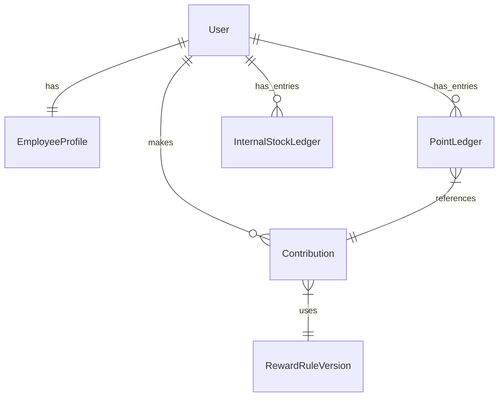

# Database Schema Design

**Architecture**: Ledger-based, Append-only, Trusted Off-Chain Data.
**Database**: PostgreSQL
**ORM**: Prisma (implied usage)

## Core Principles
1. **Append-Only Ledgers**: `PointLedger` and `InternalStockLedger` are strict append-only tables. "Current Balance" is a derived view or a cached snapshot, never a mutable field.
2. **Immutability**: Once a reward or transaction is finalized, it cannot be modified. Corrections require a countering transaction.
3. **Auditability**: Every write to a sensitive table includes a reason code and trace ID (correlation ID from event bus).

---

## 1. Identity & Profile

### `User`
Core identity table.
- `id`: UUID (PK)
- `email`: String (Unique)
- `walletAddress`: String? (Unique, ERC-20 address)
- `createdAt`: Timestamp
- `updatedAt`: Timestamp

### `EmployeeProfile`
HR-related data, separated for privacy and logical separation.
- `id`: UUID (PK)
- `userId`: UUID (FK -> User.id)
- `department`: String (Index)
- `role`: String
- `startDate`: User's start date (for vesting calculation)
- `status`: Enum (ACTIVE, TERMINATED, ALUMNI)
- `version`: Int (Optimistic locking)

---

## 2. Contributions & Rewards

### `RewardRuleVersion`
Versioning of the logic used to calculate rewards. Critical for IPO audit to explain *why* someone got X points in 2024.
- `id`: UUID (PK)
- `version`: String (e.g., "2025.v1")
- `rulesJson`: JSONB (The formulas/weights)
- `activeFrom`: Timestamp
- `activeTo`: Timestamp?

### `Contribution`
- `id`: UUID (PK)
- `userId`: UUID (FK -> User.id)
- `type`: Enum (PR, JIRA_TICKET, MANUAL, BONUS)
- `externalId`: String? (e.g., GitHub PR ID)
- `status`: Enum (PENDING, APPROVED, REJECTED)
- `pointsCalculated`: Decimal
- `rewardRuleId`: UUID (FK -> RewardRuleVersion.id)
- `auditLogId`: UUID (FK -> AuditLog.id)

---

## 3. Financial Ledgers (The "Truth")

### `PointLedger`
The source of truth for "Points" (Pre-token currency).
**Strict Append-Only**.
- `id`: UUID (PK)
- `userId`: UUID (FK -> User.id)
- `amount`: Decimal (Positive for earnings, Negative for distinct spend events)
- `reason`: String (e.g., "Contribution #123 Approved")
- `referenceId`: UUID? (FK -> Contribution.id or Bonus.id)
- `transactionType`: Enum (EARN, REDEEM, EXPIRE, CONVERT_TO_TOKEN)
- `occurredAt`: Timestamp (Index)
- `balanceSnapshot`: Decimal (Calculated running balance after this tx, for quick reads. Verified by replaying ledger.)

### `InternalStockLedger`
The source of truth for ESOP/RSU grants.
**Strict Append-Only**.
- `id`: UUID (PK)
- `userId`: UUID (FK -> User.id)
- `grantId`: String (Grouping for a specific grant letter)
- `action`: Enum (GRANT, VEST, EXERCISE, CANCEL)
- `quantity`: Decimal
- `vestingDate`: Timestamp?
- `exercisePrice`: Decimal?
- `occurredAt`: Timestamp
- `auditLogId`: UUID

---

## 4. Blockchain Sync

### `TokenSnapshot`
Since the blockchain is the ultimate truth for the ERC-20 token, this table is just a cache/snapshot for UI performance.
- `id`: UUID (PK)
- `userId`: UUID
- `walletAddress`: String
- `onChainBalance`: Decimal
- `blockNumber`: BigInt
- `syncedAt`: Timestamp

---

## 5. Metadata & Audit

### `BonusSnapshot`
Record of specific bonus events/cycles.
- `id`: UUID
- `name`: String (e.g., "Q1 2025 Spot Bonus")
- `totalDistributed`: Decimal
- `finalizedAt`: Timestamp

### `YearlyRewardSnapshot`
Performance optimization for historical queries.
- `id`: UUID
- `userId`: UUID
- `year`: Int
- `totalPointsEarned`: Decimal
- `totalStockVested`: Decimal

### `AuditLog`
Cross-cutting audit trail.
- `id`: UUID (PK)
- `actorUserId`: UUID? (Who did it?)
- `action`: String
- `entityType`: String
- `entityId`: String
- `oldValue`: JSONB?
- `newValue`: JSONB?
- `ipAddress`: String?
- `userAgent`: String?
- `createdAt`: Timestamp

---

## Relationships Diagram

## Indexing Strategy
1. **Ledgers**:
   - `PointLedger(userId, occurredAt)`: Fast retrieval of user history.
   - `InternalStockLedger(userId, grantId)`: Grouping specific grants.
2. **Contributions**:
   - `Contribution(userId, status)`: "My Pending Contributions".
   - `Contribution(externalId)`: preventing duplicate ingestion.
3. **Audit**:
   - `AuditLog(entityId, entityType)`: "Show me history of this object".
